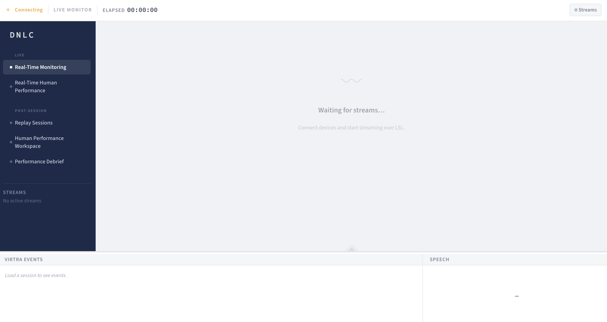

# LabReplay

> **LabReplay** is a physiological data visualizer, replay, and human performance analysis platform for VirTra-based training research. It displays multi-modal sensor data during live training scenarios and lets users replay, visualize, and analyze sessions through a web dashboard.



---

## Quick Answer: What Does This Do?

LabReplay has **four capabilities**:

1. **Record** — Captures heart rate, gaze, head motion, VirTra events, and speech in real time into a single `.db` file.
2. **Replay** — Re-publishes any recorded session over the network as if it were live, with full transport control (powered by TotalRecall).
3. **Monitor** — Displays all sensor streams as live charts in a browser dashboard.
4. **Analyze** — Computes physiological epoch metrics (Δ HR, Δ pupil, Δ motion) per training engagement, with aggregate, per-engagement, and session-comparison views.

---

## Architecture & Documentation

Read these two documents first — they give you the full mental model:

1. **[`SYSTEM_MAP.md`](SYSTEM_MAP.md)** — How all four components fit together, both data flow modes, and the communication contracts between them.
2. **[`Backend/api/contract.md`](Backend/api/contract.md)** — Every WebSocket message the system sends and receives (the "language" Frontend and Backend speak).

Then read the `OVERVIEW.md` inside whichever component you're working on:
- [`total-recall/OVERVIEW.md`](total-recall/OVERVIEW.md)
- [`Backend/OVERVIEW.md`](Backend/OVERVIEW.md)
- [`Analysis/OVERVIEW.md`](Analysis/OVERVIEW.md)
- [`Frontend/OVERVIEW.md`](Frontend/OVERVIEW.md)

---

## System Requirements

| Requirement | Details |
|-------------|---------|
| **Python** | 3.11+ (Backend, total-recall); 3.14+ (Analysis) |
| **uv** | Python package manager — install from [astral.sh/uv](https://astral.sh/uv) |
| **Node.js** | Not required — Frontend is plain HTML/JS, no build step |
| **Browser** | Chrome or Firefox (Plotly.js requires a modern browser) |
| **LSL** | Lab Streaming Layer — installed via `pylsl` (Python) or hardware drivers |
| **OS** | macOS (primary), Windows (supported via Total Recall .bat scripts) |

### Python Dependencies by Component

| Component | Key Libraries | Managed by |
|-----------|--------------|-----------|
| `total-recall` | `pylsl`, `numpy`, `tkcalendar`, `pynput` | Poetry (`pyproject.toml`) |
| `Backend` | `websockets`, `pylsl`, `numpy` | uv (`.venv`) |
| `Analysis` | `fastapi`, `uvicorn`, `numpy`, `scipy` | uv (`pyproject.toml`) |
| `Frontend` | `plotly.js` (CDN), vanilla JS | None — no build step |

---

## Getting Started: First Run

### Step 1 — Install uv (if you don't have it)

```bash
curl -LsSf https://astral.sh/uv/install.sh | sh
```

### Step 2 — Set up each Python component

```bash
# Backend
cd Backend
uv sync          # creates .venv and installs dependencies

# Analysis
cd ../Analysis
uv sync

# Total Recall (uses Poetry — but uv can run it too)
cd ../total-recall
# Dependencies are managed by Poetry; run with:
# poetry install   OR use the existing .venv if already set up
```

### Step 3 — Start all four processes

Open four terminal tabs:

```bash
# Tab 1 — Total Recall (session recorder / replayer)
cd total-recall
uv run python main.py          # headless
# or: python guiapp.py         # Tkinter desktop GUI (recommended for operators)

# Tab 2 — Backend (WebSocket server)
cd Backend
uv run python websocket_bridge.py

# Tab 3 — Analysis API (post-session analysis)
cd Analysis
uv run python main.py

# Tab 4 — Frontend (web dashboard)
cd Frontend
python3 -m http.server 8080
```

Then open **http://localhost:8080** in your browser.

---

## Configuration

### Backend — `Backend/config.toml`

```toml
[server]
host = "0.0.0.0"   # Change to "localhost" to restrict to local machine
port = 8500

[replay]
db_scan_directory     = "../total-recall/sessions"   # Where .db files live
total_recall_directory = "../total-recall"            # Total Recall install path
```

> The Frontend auto-detects the Backend host from `window.location.hostname`, so **no Frontend config is needed** — the same build works on `localhost` or a LAN IP.

### Analysis — `Analysis/config.py`

Points to the same `sessions/` directory so it can find `.db` files for post-session analysis. Edit `SESSIONS_DIR` if your sessions folder is in a different location.

### Total Recall — `total-recall/config.toml`

Controls inlet names, session output directory, and replay settings. Managed by `config_mgr.py`.

---

## Project Structure at a Glance

```
LabReplay/
├── total-recall/       # Session recorder + LSL replayer   (Python / Tkinter)
├── Backend/            # WebSocket server + session hub     (Python / asyncio)
├── Analysis/           # Post-session REST API              (Python / FastAPI)
├── Frontend/           # Browser dashboard                  (HTML / JS / CSS)
│
├── SYSTEM_MAP.md       # ← Full system integration map (start here)
└── README.md           # ← This file
```

---

## The Two Modes

Everything in the system is organized around two distinct operating modes:

### Live Mode
Sensors are physically connected. Total Recall records. The Backend receives
LSL streams and broadcasts them to the Frontend in real time.

**Pages active:** Real-Time Monitoring · Real-Time Human Performance

**Math path:** The BehDisc scoring engine runs in the **browser** (`js/intel/`)
using streamed engagement events — no Analysis API call needed.

### Replay Mode
A `.db` session file is loaded. Total Recall re-publishes it as LSL.
The Backend treats the replay identically to live — the Frontend doesn't know the difference.

**Pages active:** Replay Sessions · Human Performance Workspace

**Math path:** The **Analysis API** reads the `.db` directly, computes
epoch metrics on demand (on the Python server), and returns JSON for the
Frontend to render.

---

## Where Things Live: Quick Reference

| Functionality | Location |
|------------|---------|
| Understand the full system | `SYSTEM_MAP.md` |
| Change how sessions are recorded | `total-recall/lsl_replay_publisher.py` |
| Add a new WebSocket message type | `Backend/api/message_types.py` + `message_types.js` |
| Change session playback logic | `Backend/services/replay_service.py` |
| Change live Intel capture logic | `Backend/services/live_service.py` |
| Add a new drill (e.g. L2GoNoGo) | `Analysis/drills/` — create a package + register in `__init__.py` |
| Add a new physiological signal | `Analysis/signals/` — create a class + register in `registry.py` |
| Change a chart's appearance | `Frontend/js/charts/chart-<name>.js` |
| Add a new page view | `Frontend/js/pages/` — new controller + topbar, register in `app.js` |
| Change the sidebar colors/layout | `Frontend/css/variables.css` + `layout.css` |
| Change page-specific styles | `Frontend/css/pages/<page-name>.css` |

---

## Key Concepts to Understand First

### Lab Streaming Layer (LSL)
LSL is a network protocol for real-time streaming of time-series data
(like EEG, heart rate, gaze). Each sensor publishes an **outlet**; the
Backend opens an **inlet** per stream. Think of it as pub/sub for sensor data.
→ Learn more: [labstreaminglayer.org](https://labstreaminglayer.org)

### The `.db` Session File
A SQLite database recorded by Total Recall. Contains one table per stream,
each row being a sample with an LSL timestamp and a JSON/float array of data.
This file is the single source of truth for both Replay (playback) and
Analysis (epoch computation).

### Epoch Analysis
The Analysis component slices each engagement into two windows relative to
the event timestamp:
- **Baseline window** — N seconds *before* the event (resting state)
- **Analysis window** — N seconds *after* the event (response)

It computes the delta from baseline mean per bin, giving you "how much did
HR/pupil/motion change relative to rest?"

### The LabReplay Namespace
All Frontend JavaScript attaches to `window.LabReplay`. For example:
`LabReplay.StreamRouter`, `LabReplay.EventBus`, `LabReplay.ModeManager`.
No build step, no bundler — every module is a plain `<script>` tag.
New `js/shared/` modules use native ES module `import`/`export` and are
bridged onto `LabReplay.Shared`.

---

## Troubleshooting

| Symptom | Likely cause | Fix |
|---------|-------------|-----|
| Dashboard shows "Disconnected" | Backend not running | Start `websocket_bridge.py` |
| No sessions appear in Replay | Wrong `db_scan_directory` | Check `Backend/config.toml` |
| Analysis API unreachable warning | Analysis not running | Start `Analysis/main.py` |
| No streams appear in Live | LSL sensors not publishing | Check Total Recall GUI; verify pylsl version |
| Charts empty after replay starts | Stream not subscribed | Check browser console for `[StreamRouter]` logs |
| `ModuleNotFoundError` on startup | venv not activated / uv sync not run | Run `uv sync` inside the component directory |

---

## Further Reading

| Document | Contents |
|----------|---------|
| [`SYSTEM_MAP.md`](SYSTEM_MAP.md) | Full architecture diagram, data flows, communication contracts |
| [`Backend/api/contract.md`](Backend/api/contract.md) | Every WebSocket message (request + response format) |
| [`total-recall/OVERVIEW.md`](total-recall/OVERVIEW.md) | Total Recall internals: recording, replay, SQL layer |
| [`Backend/OVERVIEW.md`](Backend/OVERVIEW.md) | Backend architecture: coordinator pattern, service split |
| [`Analysis/OVERVIEW.md`](Analysis/OVERVIEW.md) | Epoch math, drill registry, REST API spec |
| [`Frontend/OVERVIEW.md`](Frontend/OVERVIEW.md) | Page controllers, chart plugins, CSS structure |